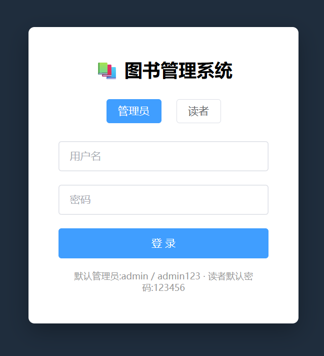
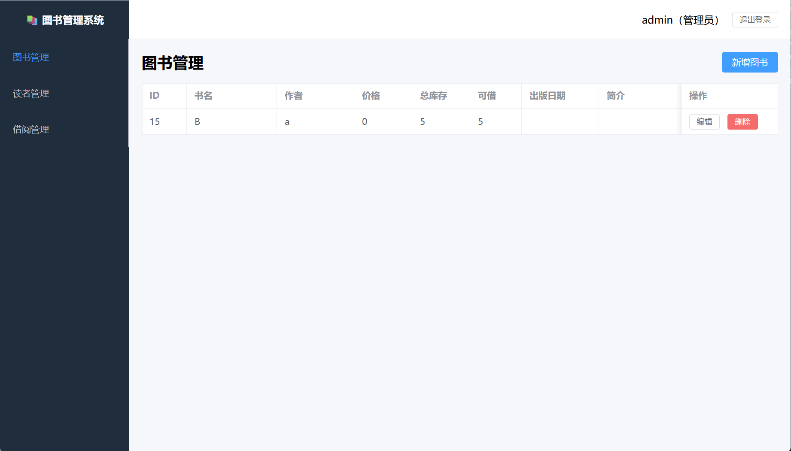
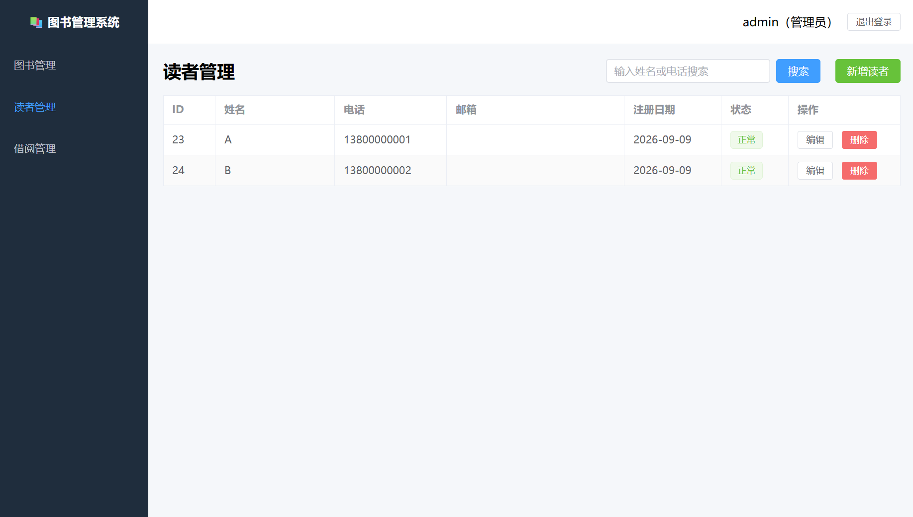
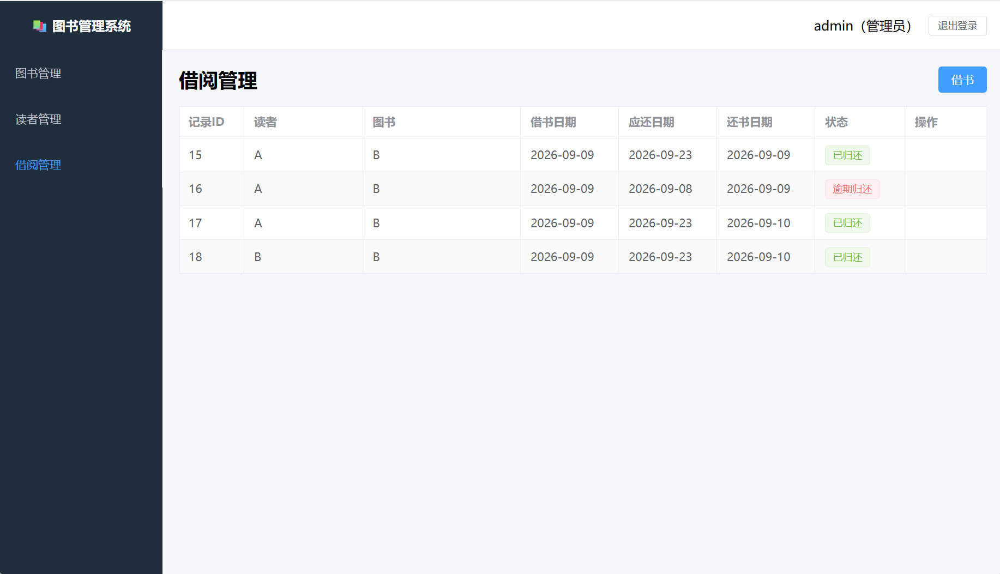
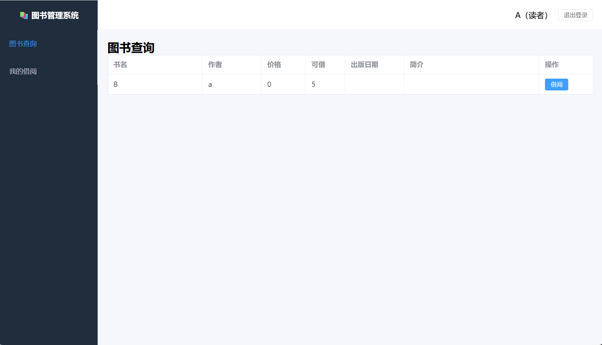

# 📚 图书管理系统（Library Management System）

一个**前后端分离**的图书管理系统，支持**管理员**和**读者**两种角色登录，实现图书、读者、借阅三大模块的完整管理，并内置基于 **JWT** 的登录鉴权与角色权限控制。

后端用 FastAPI 提供 RESTful API，前端用 Vue3 独立开发，两者通过 HTTP 接口交互。

## ✨ 功能特性

| 模块 | 管理员 | 读者 |
|------|--------|------|
| 登录 | 用户名 + 密码 | 手机号 + 密码 |
| 图书管理 | 增 / 删 / 改 / 查 | 查询 + 借阅 |
| 读者管理 | 增 / 删 / 改 / 查 + 搜索 | — |
| 借阅管理 | 登记借书 / 还书 / 查看记录 | 我的借阅 / 自助还书 |

## 🛠 技术栈

### 后端（`library_api/`）
- **FastAPI** — Web 框架
- **SQLAlchemy** — ORM 对象关系映射
- **MySQL** — 数据库
- **PyJWT** — 签发 / 校验 JWT token
- **bcrypt** — 密码哈希
- **Pydantic** — 请求 / 响应数据校验

### 前端（`frontend/`）
- **Vue 3** — 组合式 API（`<script setup>`）
- **Vite** — 开发服务器 + 打包
- **Element Plus** — UI 组件库
- **vue-router** — 路由 + 路由守卫
- **axios** — HTTP 请求（拦截器）

## 🏗 设计思路

### 1. 前后端分离
前端（Vue）和后端（FastAPI）是两个独立项目，通过 HTTP JSON 接口通信。前端开发时用 Vite 的代理（`/api` → 后端）解决跨域问题。

### 2. 后端三层架构
后端按职责分成三层，从外到内：

```
routers/        路由层：接收 HTTP 请求、做鉴权、调用 service
services/       业务层：核心业务逻辑（借书还书的规则、校验）
repositories/   数据层：只负责和数据库打交道（SQLAlchemy 增删改查）
```

好处：每层只做一件事，改数据库不影响业务逻辑，业务规则集中一处，便于测试和维护。

### 3. JWT 无状态鉴权
登录成功后，后端签发一张 JWT（token），里面携带「用户 id + 角色 + 过期时间」。之后每次请求，前端自动在请求头带上它，后端验票即可，服务器无需保存登录状态。

### 4. 基于角色的权限控制
接口和前端路由都按角色区分：
- 管理员专用接口：`require_admin`（如图书 / 读者的增删改）
- 读者自服务接口：`get_current_user`（如借书、还书、我的借阅）
- 前端路由守卫 + 菜单按角色动态显示

## 📦 功能设计

### 登录鉴权
- 两种角色：管理员（用户名）、读者（手机号）
- 密码用 bcrypt 哈希存储，数据库不存明文
- 登录成功返回 JWT token，前端存 localStorage
- token 过期 / 无效 / 未登录，统一返回 401

### 图书模块
- 字段：书名、作者、价格、总库存、可借数量、出版日期、简介
- 借书减少可借数量，还书增加；删除前校验是否存在未归还的借阅记录

### 读者模块
- 字段：姓名、手机号、邮箱、注册日期、状态
- 新增读者默认密码 `123456`
- 删除前校验是否存在借阅记录（外键约束）

### 借阅模块
- 借书：登记借阅记录，生成应还日期，扣减可借库存
- 还书：记录归还日期，恢复库存
- 读者端只能查看 / 操作自己的借阅记录

## 🗄 数据库设计

| 表 | 说明 | 关键字段 |
|----|------|---------|
| `books` | 图书 | title, author, price, total_stock, available |
| `readers` | 读者 | name, phone(唯一), password_hash, status |
| `borrow_records` | 借阅记录 | book_id, reader_id, borrow_date, due_date, return_date, status |
| `admins` | 管理员 | username(唯一), password_hash |

## 📂 项目结构

```
library_api/
├── main.py              # 应用入口
├── database.py          # 数据库连接
├── models.py            # SQLAlchemy 表模型
├── schemas.py           # Pydantic 请求 / 响应模型
├── security.py          # JWT + bcrypt + 鉴权依赖
├── init_db.py           # 初始化数据库（建表 + 默认账号）
├── routers/             # 路由层
│   ├── auth.py          #   登录 / 获取当前用户
│   ├── books.py         #   图书
│   ├── readers.py       #   读者
│   ├── borrows.py       #   借阅（管理员）
│   └── me.py            #   读者自服务
├── services/            # 业务层
├── repositories/        # 数据层
├── tests/               # pytest 自动化测试
├── requirements.txt
└── frontend/            # 前端（Vue3）
    ├── src/
    │   ├── api/         #   axios 封装 + 各模块接口
    │   ├── router/      #   路由 + 守卫
    │   ├── utils/       #   token 存取
    │   └── views/       #   页面组件
    ├── vite.config.js   #   Vite 配置（代理）
    └── package.json
```

## 🚀 如何运行

### 后端
1. 安装依赖：`pip install -r requirements.txt`
2. 在 MySQL 中建库，修改 `database.py` 里的数据库连接（账号 / 密码）
3. 初始化：`python init_db.py`（建表 + 写入默认管理员和读者密码）
4. 启动：`uvicorn main:app --reload`
5. 接口文档：http://127.0.0.1:8000/docs

### 前端
1. 安装依赖：`cd frontend && npm install`
2. 启动：`npm run dev`
3. 访问：http://localhost:5173

## 🔑 默认账号

| 角色 | 账号 | 密码 |
|------|------|------|
| 管理员 | `admin` | `admin123` |
| 读者 | `13800000001` | `123456` |

## 🔌 接口一览

| 方法 | 路径 | 说明 | 权限 |
|------|------|------|------|
| POST | `/auth/login` | 登录 | 公开 |
| GET | `/auth/me` | 当前用户信息 | 登录 |
| GET | `/books` | 图书列表 | 登录 |
| GET | `/books/{id}` | 图书详情 | 登录 |
| POST | `/books` | 新增图书 | 管理员 |
| PUT | `/books/{id}` | 修改图书 | 管理员 |
| DELETE | `/books/{id}` | 删除图书 | 管理员 |
| GET | `/readers` | 读者列表 | 管理员 |
| GET | `/readers/search` | 搜索读者 | 管理员 |
| POST | `/readers` | 新增读者 | 管理员 |
| PUT | `/readers/{id}` | 修改读者 | 管理员 |
| DELETE | `/readers/{id}` | 删除读者 | 管理员 |
| GET | `/borrows` | 借阅记录 | 管理员 |
| POST | `/borrow` | 登记借书 | 管理员 |
| POST | `/borrows/{id}/return` | 还书 | 管理员 |
| GET | `/me/borrows` | 我的借阅 | 读者 |
| POST | `/me/borrow` | 借书 | 读者 |
| POST | `/me/borrows/{id}/return` | 还书 | 读者 |

## 🖼 项目截图

> 图片放在 `docs/images/` 目录，文件名需与下方对应。

| 登录页 | 图书管理 | 读者管理 |
|--------|---------|---------|
|  |  |  |

| 借阅管理 | 读者端-图书查询 |
|---------|----------------|
|  |  |

## 🧪 测试

后端提供 pytest 接口自动化测试（`tests/test_auth.py`）：

```bash
python -m pytest tests/ -v
```

## ⚠️ 安全提醒

- `security.py` 里的 `SECRET_KEY` 和 `database.py` 里的数据库密码是**写死的**，仅用于本地学习。正式上线务必改成从环境变量读取。
- token 有效期默认 24 小时，可在 `security.py` 中调整。
